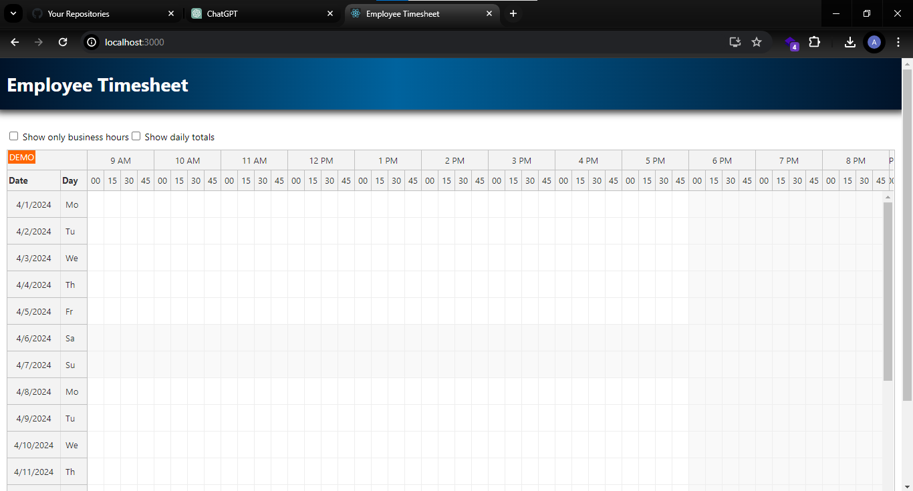

## Project Initialization

Run `npm install` to download all dependencies.

## Running the Project

Run `npm start` to start the built-in web server at [http://localhost:3000](http://localhost:3000).

## Build

Run `npm run build` to build the project.

